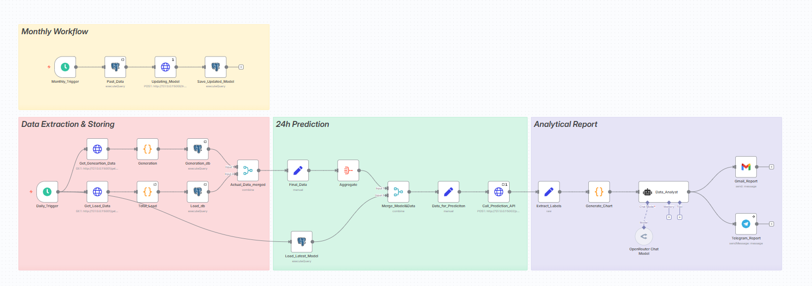

# ⚡ Power Grid ML Automation

[](https://n8n.io/)
[](https://www.postgresql.org/)
[](https://xgboost.readthedocs.io/)
[](https://opensource.org/licenses/MIT)

A fully automated end-to-end machine learning pipeline for electrical grid load forecasting and analytical reporting. Built with **n8n**, **PostgreSQL**, and **XGBoost** to deliver daily intelligence reports before the workday begins.



---

## 🎯 Overview

This project automates the complete machine learning lifecycle for power system operations:

- **Daily Data Pipeline**: Automated ingestion of 24-hour grid data
- **Load Forecasting**: Next-day predictions using XGBoost
- **Automated Reporting**: Reports delivered via Email & Telegram at 6 AM
- **Model Management**: Monthly auto-retraining to prevent model drift

---

## ✨ Key Features

| Feature | Description |
|---------|-------------|
| 🔄 **End-to-End Automation** | Zero manual intervention from data ingestion to report delivery |
| 📊 **Daily Intelligence** | 6 AM automated workflow with previous day analysis + next-day forecasts |
| 🤖 **Model Lifecycle Management** | Monthly retraining with automatic deployment |
| 📧 **Multi-Channel Delivery** | Reports via Email and Telegram |
| 🎯 **Operational Ready** | Insights for power plant dispatching & grid load balancing |

---

  ```text
  ┌─────────────────────────────────────────────────────────────────┐
  │                        n8n Orchestration                        │
  ├─────────────────────────────────────────────────────────────────┤
  │                                                                 │
  │  ┌──────────┐    ┌──────────┐    ┌──────────┐    ┌──────────┐   │
  │  │  Data    │──▶│ Postgres │───▶│ XGBoost  │───▶│  Report │   │
  │  │ Ingestion│    │ Storage  │    │ Forecast │    │ Delivery │   │
  │  └──────────┘    └──────────┘    └──────────┘    └──────────┘   │
  │                                                                 │
  │  Daily Workflow (6 AM)              Monthly Retraining          │
  └─────────────────────────────────────────────────────────────────┘
                                │
                                ▼
                      ┌──────────────────┐
                      │  📧 Email       │
                      │  📱 Telegram    │
                      └──────────────────┘

  ```
---

## 🛠️ Tech Stack

- **Workflow Automation**: [n8n](https://n8n.io/)
- **Database**: PostgreSQL
- **Machine Learning**: XGBoost, Python, scikit-learn
- **Notifications**: Email (SMTP), Telegram Bot API
- **Data Processing**: Pandas, NumPy

---

## 🚀 Quick Start

### Prerequisites

- Python 3.8+
- PostgreSQL 13+
- n8n (self-hosted or cloud)
- Telegram Bot Token (optional)

### Installation

1. **Clone the repository**
   ```bash
   git clone https://github.com/yourusername/power-grid-ml-automation.git
   cd power-grid-ml-automation
2. **Install dependencies**

    ```bash
    pip install -r requirements.txt
3. **Set up environment variables**

    ```bash
    cp .env.example .env
    # Edit .env with your credentials

4. **Initialize the database**

    ```bash
    psql -U postgres -f sql/schema.sql
5. **Import n8n workflows**

    Open n8n dashboard
    Import workflows/daily_pipeline.json
    Import workflows/monthly_retraining.json

6. **Configure and activate workflows**

    Update credentials in n8n
    Activate both workflows

# ⚙️ Configuration
Create a .env file:

   ```env

   # Database
   DB_HOST=localhost
   DB_PORT=5432
   DB_NAME=power_grid
   DB_USER=your_user
   DB_PASSWORD=your_password

   # Telegram
   TELEGRAM_BOT_TOKEN=your_bot_token
   TELEGRAM_CHAT_ID=your_chat_id

   # Email
   SMTP_HOST=smtp.gmail.com
   SMTP_PORT=587
   SMTP_USER=your_email
   SMTP_PASSWORD=your_app_password

   # Model
   MODEL_PATH=./models/model.pkl
   RETRAIN_DAY=1  # Day of month for retraining
```
# 📈 Workflows
## Daily Pipeline (6:00 AM)

  Retrieve previous 24 hours of grid data

  Store raw data in PostgreSQL

  Preprocess and feature engineering

  Generate next-day load forecast

  Create analytical report

  Deliver via Email & Telegram

## Monthly Retraining (1st of each month)

  Consolidate historical data

  Feature engineering on full dataset

  Train new XGBoost model

  Evaluate model performance

  Deploy if metrics improve

  Archive old model

# 📊 Sample Output
```text
Daily Report Preview
📊 DAILY GRID INTELLIGENCE REPORT
📅 Date: 2024-01-15
━━━━━━━━━━━━━━━━━━━━━━━━━━━━━━━
📈 YESTERDAY'S SUMMARY
• Peak Load: 1,245 MW at 14:30
• Min Load: 678 MW at 04:15
• Total Consumption: 21,456 MWh
• Avg Load: 894 MW

━━━━━━━━━━━━━━━━━━━━━━━━━━━━━━━
🔮 NEXT-DAY FORECAST
• Expected Peak: 1,312 MW at 15:00
• Expected Min: 702 MW at 04:00
• Predicted Consumption: 22,105 MWh

━━━━━━━━━━━━━━━━━━━━━━━━━━━━━━━
💡 RECOMMENDATIONS
• Consider additional capacity 14:00-17:00
• Optimal maintenance window: 02:00-05:00
```
# 🤝 Contributing
Contributions are welcome! Please feel free to submit a Pull Request.

1. Fork the repository
2. Create your feature branch (git checkout -b feature/AmazingFeature)
3. Commit your changes (git commit -m 'Add some AmazingFeature')
4. Push to the branch (git push origin feature/AmazingFeature)
5. Open a Pull Request
   
# 📄 License
This project is licensed under the MIT License - see the LICENSE file for details.

# 📬 Contact
Your Name - @yourtwitter - your.email@example.com

Project Link: https://github.com/yourusername/power-grid-ml-automation

# 🙏 Acknowledgments
n8n for the powerful automation platform
XGBoost for the ML framework
Power systems engineering community
<p align="center"> Made with ⚡ for the Power Industry </p> ```
